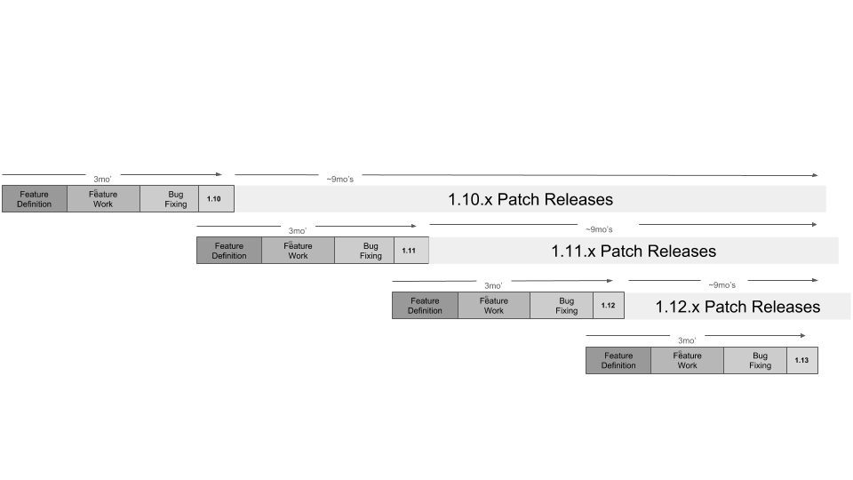

## K8S综述[Return Parent](../README.md)

- #### Kubernetes版本

  - ##### 版本号：

  Kubernetes 版本号格式为 **x.y.z**，其中 **x** 为大版本号，**y** 为小版本号，**z** 为补丁版本号。版本号格式遵循 [Semantic Versioning](https://semver.org/) 规则。

  x大版本号:  when you make incompatible API changes,

  y小版本号: when you add functionality in a backwards compatible manner, 

  z补丁版本号： when you make backwards compatible bug fixes.

  

  

  - ##### 各组件间协作对版本的要求

  **`kubelet`**： 版本号不能高于 `kube-apiserver`，最多可以比 `kube-apiserver` 低两个小版本。

  在 可用（HA）集群中， 多个 `kube-apiserver` 实例小版本号最多差1。

  `kube-controller-manager`、`kube-scheduler` 和 `cloud-controller-manager` 版本不能高于 `kube-apiserver` 版本号。最好它们的版本号与 `kube-apiserver` 保持一致，但允许比 `kube-apiserver` 低一个小版本。

  `kubectl` 可以比 `kube-apiserver` 高一个小版本，也可以低一个小版本。

  

  - ##### 发布周期

    通常补丁是按月发布。但是在某个小版本发布后的最初补丁发布上要快一些，通常是1~2个星期。当然，在发现严重bug时，可能会立即发布补丁。 

    每个小版本的发布周期大约是3个月， 所以K8S每年大约会发布4个版本。

    发布过程参见： https://github.com/kubernetes/community/blob/master/contributors/devel/sig-release/release.md

    发布流程：

    

  kubernetes版本发布计划见：https://github.com/kubernetes/sig-release/blob/master/releases/patch-releases.md

- #### kubernetes可以支持对象的体量

  在 v1.21 版本中， Kubernetes 支持的最大节点数为 5000。具体的来说，v1.21 版本可以支持如下体量的对象：

  - 节点数不超过 5000
  - Pod 总数不超过 150000
  - 容器总数不超过 300000
  - 每个节点的 pod 数量不超过 100

- #### kubernetes支持的容器运行时

  在Linux平台上， Kubernetes支持以下三种容器运行时：

  containerd: https://github.com/containerd/containerd 

  CRI-O: https://github.com/cri-o/cri-o   由redhat,IBM等公司主导开发

  Docker: https://github.com/moby/moby

  Docker、CRI-O、containerd和runc之间的关系如下图所示：

  ![Diagram showing the relationships and dependencies between docker, Kubernetes, CRI-O, containerd and runc]

- #### K8S组件功能的状态

  A feature can be in *Alpha*, *Beta* or *GA* stage. An *Alpha* feature means:

  **Alpha:** 

  - Disabled by default
  - Might be buggy. Enabling the feature may expose bugs.
  - Support for feature may be dropped at any time without notice.
  - The API may change in incompatible ways in a later software release without notice.
  - Recommended for use only in short-lived testing clusters, due to increased risk of bugs and lack of long-term support.

  **Beta：** 

  - Enabled by default.
  - The feature is well tested. Enabling the feature is considered safe.
  - Support for the overall feature will not be dropped, though details may change.
  - The schema and/or semantics of objects may change in incompatible ways in a subsequent beta or stable release. When this happens, we will provide instructions for migrating to the next version. This may require deleting, editing, and re-creating API objects. The editing process may require some thought. This may require downtime for applications that rely on the feature.
  - Recommended for only non-business-critical uses because of potential for incompatible changes in subsequent releases. If you have multiple clusters that can be upgraded independently, you may be able to relax this restriction.

  **GA(General Availability):**

  A *General Availability* (GA) feature is also referred to as a *stable* feature

  - The feature is always enabled; you cannot disable it.
  - The corresponding feature gate is no longer needed.
  - Stable versions of features will appear in released software for many subsequent versions.

  **Note:**  feature current stages of K8S ,look at: https://kubernetes.io/docs/reference/command-line-tools-reference/feature-gates/#feature-stages 

   

- 

- 

  

- 

